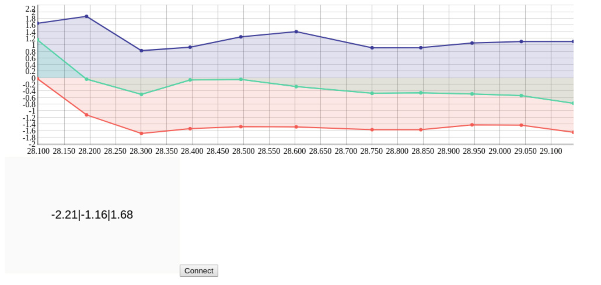
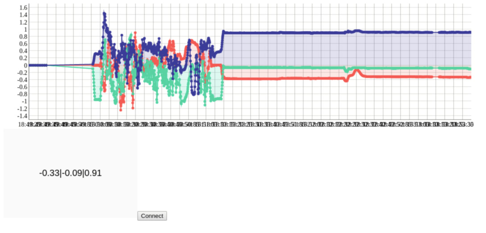

# Quickstart

This is a very simple example using the inbuilt Battery Monitor example. The javascript library used for Web Bluetooth is [p5.ble.js](https://yining1023.github.io/p5ble-website/).  

## Steps to Run

1. Load the `BatteryMonitor` example from ArduinoBLE Library
2. Open the Serial Monitor (it's important, otherwise the sketch won't progress forward to transfer data)
3. Goto the `bluetooth/web_bluetooth` folder in master and open the html file in Chrome.
4. Connect and watch the value change in the box

# Web Bluetooth Real Time Accelerometer Data Plotting

For real time plotting I am using the [_dygraph.js_](http://dygraphs.com/) library.

### Demo
1. Load the [accelerometer_xyz_plotting](https://github.com/armsp/nano-33-ble-gen/tree/master/bluetooth/real_time_plotting/accelerometer_xyz_plotting) sketch on your Nano 33 BLE
2. Open the Serial Monitor (it's important, otherwise the sketch won't progress forward to transfer data)
3. Open the [index.html](https://github.com/armsp/nano-33-ble-gen/blob/master/bluetooth/real_time_plotting/index.html) page in _Chrome_ (other browsers are not supported) and connect to your Arduino Nano 33 BLE and watch the graph update.

OR

Visit this [Web Bluetooth based Real Time Plotting](https://armsp.github.io/nano-33-ble-gen/webbluetooth_plotting.html) (after uploading the sketch and opening Serial Monitor) and follow the prompts.

* Random Plot

* Data Points shift left

* All data points stay

